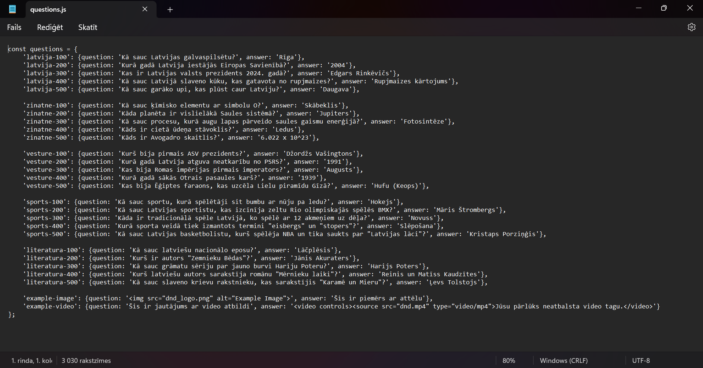
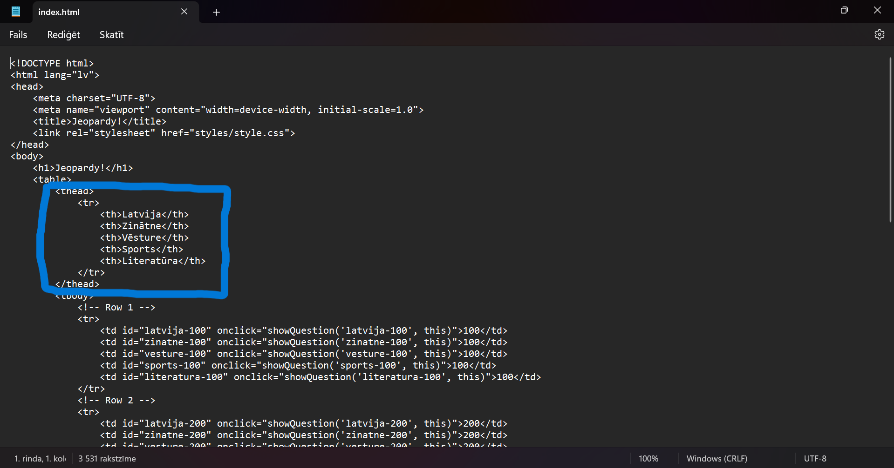
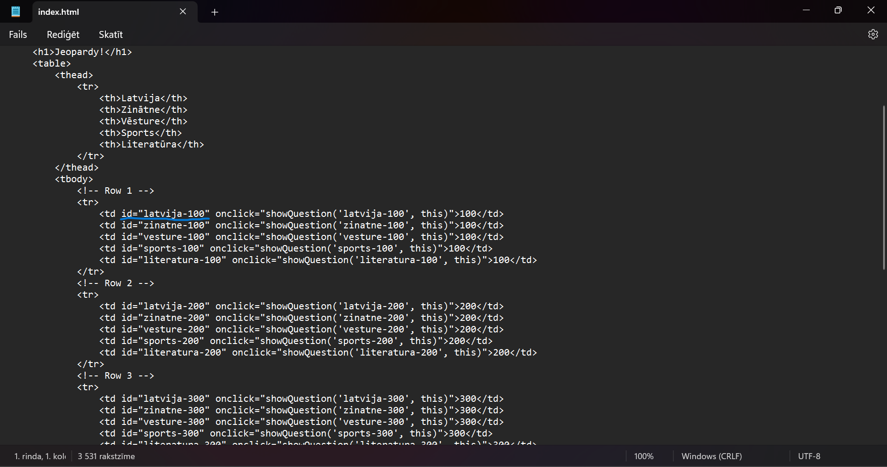
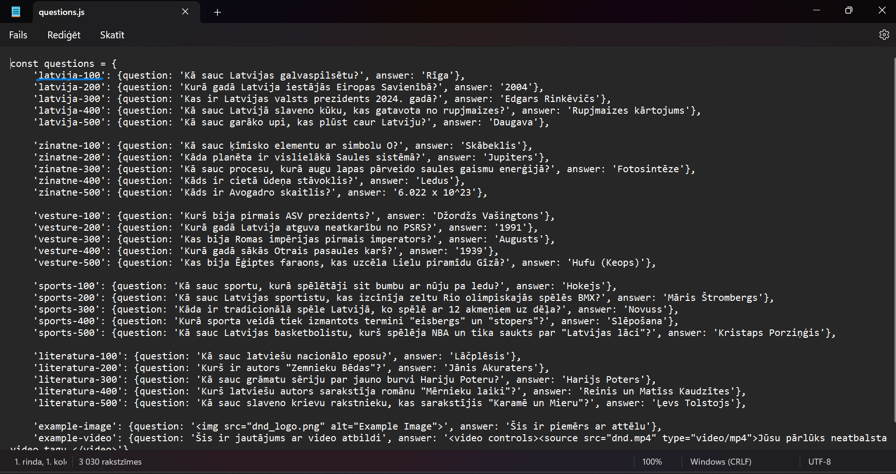

# Viktorīna

Viktorīnai ir līdzība ar jeopardy spēli un lietotājs var izveidot pats savu spēli un šī ir pamācība kā to izdarīt.

## Lejuplāde zip

Lejupielādē zip failu no saites <https://github.com/ITspecialitate/jeopardy/archive/refs/heads/main.zip>

## questions.js

 Šeit Jūs varat rediģēt savus jautājumus.

## Kā rediģēt questions.js?

* Rediģējot jautājumus un atbildes ir jāaceras, ka drīkst rediģēt tikai to, kas atrodas vienpēdiņās.
* Nav ieteicams rediģēt/izmainīt `id`
* Ja vēlaties **ievietot attēlu**, ievietojiet šo kodu `'example-image': {question: '', answer: 'Šis ir piemērs ar attēlu'},` un nomainiet `dnd_logo.png` ar savu attēla adresi, ja vēlaties varat nomainīt attēla nosaukumu, kas atrodas elementa `alt` dubultpēdiņās.
* Ja vēlaties **ievietot video**, ievietojiet šo kodu `'example-video': {question: 'Šis ir jautājums ar video atbildi', answer: '<video controls><source src="dnd.mp4" type="video/mp4">Jūsu pārlūks neatbalsta video tagu.</video>'}` aizstājiet `dnd.mp4` ar sava video atrašanās vietu.

## index.html

Ja ir nepieciešams rediģējat sadaļu virsrakstus. 

## Brīdinājumi

* Ja neesat iepriekš saskāries ar programmēšanu, tad es iesaku neaiztikt `id` t. i.

index.html 

questions.js 
